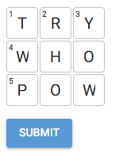

# Cross-Words  

### Current State: Word Grid Generator
 - I bit off more than I could chew at first! I'll be back to this over time. 
 - Currently, it can generate a 3x3 grid with words fitted vertically and horizontally from a dictionary. It can go larger if you have the compute for it, but.. it's not efficient.
 - The logic is in the code to add some black squares in a grid up to 15x15 in a mirrored grid and add themes and theme words, but currently my constraint solving to get each word in place is not efficient enough and will go into near infinite recursion beyond 3x3 or 4x4. 

### This will be a crossword puzzle generator. It will:
- Generate a fillable crossword puzzle with clues for each word.
- Be interactive - you will be able to solve it in the browser
- Use an LLM call to generate the word list and the hints based on:
    - Difficulty
    - Themes (i.e. space, animals, pop culture)
    - Size (x,y grid)
    - Meta-puzzle (Toggle on to enable a "meta" puzzle, such as circled letters being used in a final anagram to solve)

### TODO

Future plans include:
- A leaderboard for saved puzzles and puzzles-of-the-day
- Shareable puzzles - generate a puzzle and compete with your friends
- Multiplayer - Cooperatively solve a puzzle virtually
- Other languages
- Non-language puzzles
